## Gula Gula App

Trata-se de uma aplicação para uma pizzaria on-line, que possui abordagem voltada à utilização mobile e disponibiliza instalação via PWA para desktop e mobile. 

O projeto possui x páginas:

- ```/```: Home, são mostrados na tela todas as opções de produtos;
- ```/product/[id]```: rota dinâmicaque mostra um produto individualmente;
- ```/about```: mostra os horários de funcionamento do serviço;
- ```/search```:É possível pesquisar por produtos; 
- ```/cart```: São mostrados os itens que estão no carrinho do usuário e possibilita o envio do pedido, caso esteja vazio msotra mensagem para adicionar itens;
- ```/auth/login```: Página de login;
- ```/auth/signup```: Página de cadastro de login;
- ```/account/my-account```: Mostra os dados cadastrados e os pedidos realizados. No primeiro acesso é solicitado a complementação do cadastro com o endereço. 


## Sumário

- [Tecnologias utilizadas](#tecnologias)
- [Instruções para rodar o projeto](#instrucoes)
- [Organização e estruturação do projeto](#organizacao)
- [Desenvolvimento](#desenvolvimento)
- [Imagens](#imagens)

## Tecnologias Utilizadas <a name="tecnologias"></a>

### Frontend

- [**NextJS**](https://nextjs.org/)
- [**CSS Modules**](https://github.com/css-modules/css-modules)
- [**React Hook Form**](https://react-hook-form.com/)
- [**Yup**](https://github.com/jquense/yup/)
- [**React Redux**](https://react-redux.js.org/)
- [**Redux Tookit**](https://redux-toolkit.js.org/)
- [**React Icons**](https://react-icons.github.io/react-icons/)
- [**Framer Motion**](https://www.framer.com/)
- [**Next-Pwa**](https://github.com/shadowwalker/next-pwa/)
- [**React Hot Toast**](https://react-hot-toast.com/)
- [**React Loading Icons**](https://github.com/dkress59/react-loading-icons/)
- [**React Scroll**](https://github.com/fisshy/react-scroll/)
- [**UUID**](https://github.com/uuidjs/uuid/)
- [**Axios**](https://axios-http.com/docs/intro)


### Backend
- [**Mongoose**](https://mongoosejs.com/)
- [**Jose**](https://github.com/panva/jose)
- [**Cookie**](https://github.com/jshttp/cookie/)
- [**BcryptJS**](https://github.com/dcodeIO/bcrypt.js)


## Instruções para rodar o projeto <a name="instrucoes"></a>

### Será necessário ter instalado na sua máquina:

```
Git
NodeJS
```

- Clone o repositório com o comando **git clone**:

```
git clone https://github.com/felipehimself/gula-gula.git
```

- Entre no diretório que acabou de ser criado:

```
cd gula-gula
```

- Faça a instalação das dependências do projeto:

```
npm install
```

## Organização e estruturação do projeto <a name="organizacao"></a>

O projeto está estruturado da seguinte forma:

```
+---components
|   |   Main.tsx
|   |
|   +---AccountForm
|   |       AccountForm.tsx
|   |       Styles.module.css
|   |
|   +---BottomTab
|   |       BottomTab.tsx
|   |       Styles.module.css
|   |
|   +---Button
|   |       Button.tsx
|   |       Styles.module.css
|   |
|   +---ButtonLink
|   |       ButtonLink.tsx
|   |       Styles.module.css
|   |
|   +---CardProduct
|   |       CardProduct.tsx
|   |       Styles.module.css
|   |
|   +---CartBar
|   |       CartBar.tsx
|   |       Styles.module.css
|   |
|   +---CartItem
|   |       CartItem.tsx
|   |       Styles.module.css
|   |
|   +---ErrorMessage
|   |       ErrorMessage.tsx
|   |       Styles.module.css
|   |
|   +---Header
|   |       Header.tsx
|   |       Styles.module.css
|   |
|   +---Loading
|   |       Loading.tsx
|   |       Styles.module.css
|   |
|   +---ModalCupom
|   |       ModalCupom.tsx
|   |       Styles.module.css
|   |
|   \---Topbar
|           Styles.module.css
|           Topbar.tsx
|
+---features
|       cartSlice.ts
|
+---hooks
|       hooks.ts
|
+---lib
|       createModel.ts
|       framerMotion.ts
|       hotToast.ts
|       yup.ts
|
+---models
|       Order.ts
|       Product.ts
|       User.ts
|
+---pages
|   |   index.tsx
|   |   _app.tsx
|   |   _document.tsx
|   |
|   +---about
|   |       index.tsx
|   |
|   +---account
|   |       my-account.tsx
|   |
|   +---api
|   |   +---account
|   |   |       index.ts
|   |   |
|   |   +---auth
|   |   |       login.ts
|   |   |       logout.ts
|   |   |       signup.ts
|   |   |
|   |   +---order
|   |   |       index.ts
|   |   |
|   |   \---product
|   |           index.ts
|   |
|   +---auth
|   |       login.tsx
|   |       signup.tsx
|   |
|   +---cart
|   |       index.tsx
|   |
|   +---product
|   |       [id].tsx
|   |
|   \---search
|           index.tsx
|
+---public
|   |   favicon.ico
|   |   icon-192x192.png
|   |   icon-256x256.png
|   |   icon-384x384.png
|   |   icon-512x512.png
|   |   manifest.json
|   |   sw.js
|   |   vercel.svg
|   |   workbox-6a1bf588.js
|   |
|   \---assets
|           no-search.svg
|           pizza.jpg
|
+---store
|       store.ts
|
+---styles
|       About.module.css
|       Cart.module.css
|       Global.module.css
|       globals.css
|       Index.module.css
|       Login.module.css
|       MyAccount.module.css
|       Product.module.css
|       Search.module.css
|       Signup.module.css
|
+---ts
|   +---enums
|   |       enums.ts
|   |
|   +---interfaces
|   |       interfaces.ts
|   |       user.ts
|   |
|   \---types
|           types.ts
|
\---utils
        constants.ts
        functions.ts   
```

## Desenvolvimento <a name="desenvolvimento"></a>

### Frontend

#### [**NextJS**](https://nextjs.org/)

O projeto foi desenvolvido com o framework NextJS, que tem como base o React. Foi utilizada a abordagem ```getServerSideProps```, para gerar as páginas de forma dinâmica com dados sendo servidos pelo banco de dados. A proteção de rotas e a persistência de login foram feitas por meio da utilização de middleware para validar se o usuário está autenticado por meio da verificação do token armazenado nos cookies. 

#### [**CSS Modules**](https://github.com/css-modules/css-modules)

Para estilização dos elementos. 

#### [**React Hook Form**](https://react-hook-form.com/) e [**Yup**](https://github.com/jquense/yup/).

Para controle das informações informadas e validação dos campos dos formulários.

#### [**Redux Toolkit**](https://redux-toolkit.js.org/) e [**React Redux**](https://react-redux.js.org/)

Para controle de estados entre as telas da aplicação.

#### [**React Icons**](https://react-icons.github.io/react-icons/)

Para ícones SVG utilizados na aplicação.

#### [**Framer Motion**](https://www.framer.com/)

Para animações e transições.

#### [**Next-Pwa**](https://github.com/shadowwalker/next-pwa/)

Para possibilitar a utilização da aplicação em formato PWA, instalação em desktops e mobile.

#### [**React Hot Toast**](https://react-hot-toast.com/)

Para mostrar efeitos de notificações na tela.

#### [**React Loading Icons**](https://github.com/dkress59/react-loading-icons/)

Para demonstração de espera na transição de páginas e chamadas HTTP.

#### [**React Scroll**](https://github.com/fisshy/react-scroll/)

Para controlar os efeitos da Navbar e direcionamento para o respectivo elemento na página que possua o id vinculado ao link.  

#### [**UUID**](https://github.com/uuidjs/uuid/)

Para gerar identificadores únicos de cada pedido do cliente.

#### [**Axios**](https://axios-http.com/docs/intro)

Para realizar chamadas HTTP.


### Backend

#### [**Mongoose**](https://mongoosejs.com/)

Abordagem NOSQL utilizado como banco de dados da aplicação.

#### [**Jose**](https://github.com/panva/jose)

Utilizado para geração do JSON Web Token (JWT).

#### [**Cookie**](https://github.com/jshttp/cookie/)

Utilizado para serializar e armazenar o JWT nos cookies da requisição.

#### [**BcryptJS**](https://github.com/dcodeIO/bcrypt.js)

Utilizado para criptografar as senhas dos usuários.


## Imagens <a name="imagens" ></a>

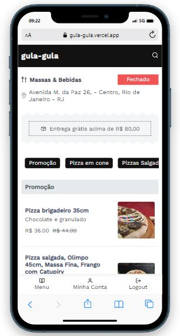 

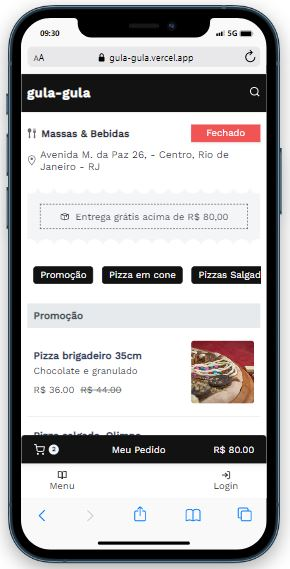 

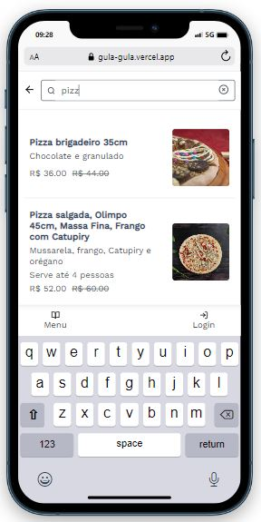 

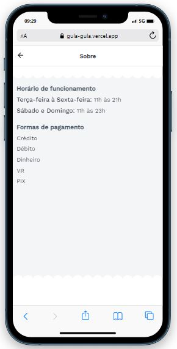 

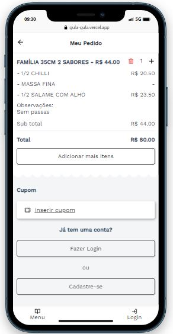 

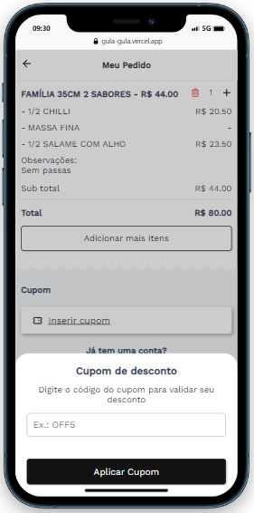 

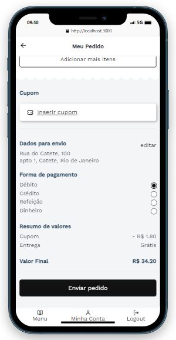 

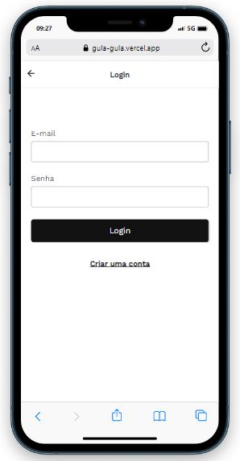 

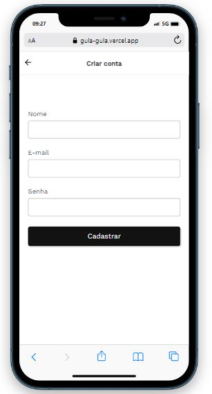 

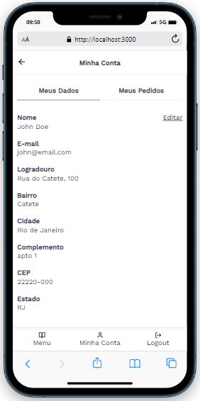 

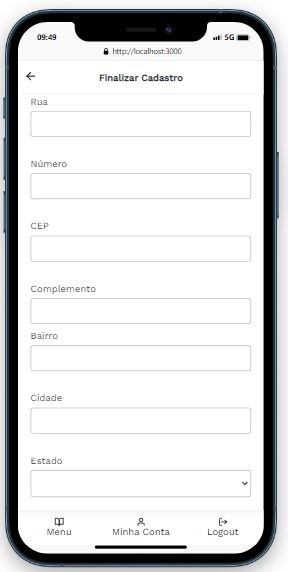 

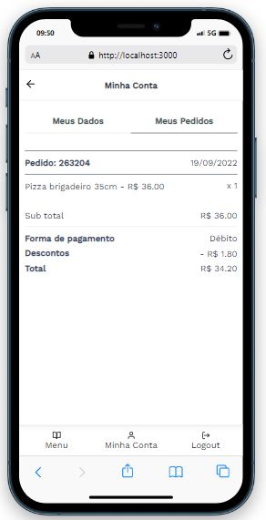 
